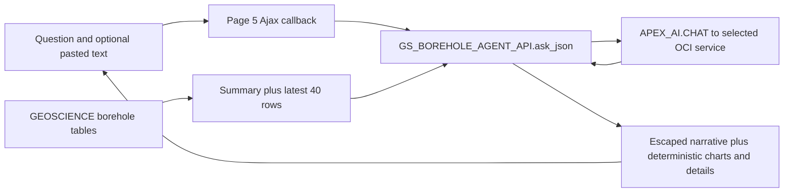

# Boreholes performance and AI review

**17 September 2026 · Recommendation only · Owner: this review task · Implementation decision: Paul Ashcroft**

Target: AIDEMODB, documented workspace/schema `GEOSCIENCE`, application **105 Boreholes Demo**, alias `BOREHOLES-DEMO`, AI Hub application project `boreholes`. App 104 was not reviewed; shared services and feedback code were inspected only where they affect app 105.

## Decision brief

Prioritize correctness and predictable service behavior before infrastructure tuning. The source contains reproducible question-routing errors, incomplete AI grounding, misleading attachment support and incomplete refresh error handling. These can make the demo appear broken even when SQL and the model are fast. Routine counts, charts and map navigation unnecessarily wait for a model response.

The highest-value changes are:

1. Verify the live model/service bindings and exclude retired models from Boreholes. The June service catalog includes two Cohere aliases retired on 30 July. This is a credible failure candidate, **not a confirmed current runtime failure**. The source normally prefers Gemini Pro; Cohere was the model selected in the historical smoke test.
2. Fix deterministic question routing and compute answers from the appropriate SQL result. Return ordinary counts/charts/maps without a model call; use AI only when explanation is useful.
3. Validate and make refresh behavior atomic, fix its zero-row success banner, and measure the network download separately from the database load.
4. Establish a small, privacy-conscious timing baseline before changing models, adding caches, indexes, agents or background processing.

The live database has only **255 boreholes**, last updated on **17 June 2026**. That is not evidence for a capacity problem. No current browser or AI-response latency was measured. Recommendations below distinguish source defects, current data observations and hypotheses.

**Implementation awaits Paul's approval.** No application/database business data, code, service, credential, infrastructure, AI Hub record or shared standard was changed. No commit, push or deployment was performed.

## Evidence and access boundaries

| Evidence | Result and limit |
| --- | --- |
| Live database identity | Saved SQLcl alias `aidemodb`, discovered as user `CODEX`; database/container `GE1C42BF10AE843_AIDEMODB`; DB version **23.26.3.3.0**, APEX **26.1.4**. AUTOCOMMIT off; session language `AMERICAN_ANTIGUA AND BARBUDA.AL32UTF8`, timezone Australia/Sydney. Database open mode was not readable. |
| Schema/data | `GEOSCIENCE` tables and package specifications visible. Relevant specs and inspected table/view objects report VALID. Package bodies and their compilation status were not visible; this does not establish that bodies are missing or invalid. |
| App/workspace identity | App 105 mapping is supported by saved project instructions, export and June verification. Current APEX dictionary queries returned no visible rows under CODEX; session workspace/current-schema selection did not expose them. Minimal internal metadata reads returned `ORA-41900: missing READ privilege`. No privilege expansion or alternative privileged account was used. Current component/service binding and source-to-live equality remain unverified. |
| Browser | Approved shared Chrome launcher inspection reported `Launch` with no running process. Available browser tools exposed only the Codex in-app browser. External Chrome was therefore not controlled or launched; no login rejection was observed and no credentials were read. Runtime journeys, accessibility and browser/network timing remain unverified. |
| Source ownership | Canonical saved checkout: `C:/Users/pashcrof/Documents/Codex Projects/Geoscience Demos`; HEAD `72f9d7f9d63cb1e123a4ef033f7246c25b0fc828`, 10 September 2026, branch `codex/geoscience-boreholes-ai`. Existing modified `.gitignore` and untracked `_gitignore_for_mac_migration` were preserved. |
| Worktree drift | Review worktree began at `b874fb116a38c8027facf470b5a448a7ff0efb6c`, 16 June 2026, before the later Boreholes source. Analysis therefore used the saved checkout read-only. Only this report is added to the worktree. |
| Export/runtime drift | Latest saved app 105 checkpoint is **17 June**, exporting APEX **24.2.16**; live engine is **26.1.4**. July source-cleanup and September documentation commits are not new runtime/performance tests. No new full export was attempted. |

SQLcl's named local executable was checked but its direct launch failed to initialize Java security. The already configured SQLcl MCP service successfully connected using the discovered saved credential. No runtime configuration was repaired. SQLcl's normal audit/session activity is distinct from application business writes.

## Architecture and the AI request flow

The app is a small Oracle APEX application served through AIDEMODB ORDS in Sydney. It stores a bounded extract from Geoscience Australia's public Boreholes WFS in `GS_BOREHOLES`. Refresh history and source provenance live in `GS_DATA_REFRESH_RUNS` and `GS_BOREHOLE_SOURCES`. A separate five-row seed source is still included in application totals.

Most user-facing regions are generated by `GS_BOREHOLE_PAGE_API`, which combines HTML, CSS and JavaScript in PL/SQL. Reports page 6 already uses a **native APEX Map** with clustering. Explorer page 2 retains a custom SVG and a capped HTML table. Page 3 is a generated borehole form. Native APEX feedback is queued through shared `GS_AI_HUB_FEEDBACK`; forwarding was deliberately deferred in the June design.

The only AI request path identified in the reviewed source is **Ask AI, page 5**:

In detail:

- The browser sends question `x01`, service static ID `x02`, and attachment metadata/text context `x03` to `GS_BOREHOLES_AGENT_ASK` (component **1050100502**).
- The package accepts an OCI service present in the workspace. Its default preference is `google_gemini_2_5_pro`, then Flash, then GPT OSS 120B; the model selector lists all OCI services. Existence is checked, not current health or app-role suitability.
- `build_ai_context` supplies rules, dataset totals, up to 12 state/region groups and the **latest 40 rows regardless of the question**. User question and supplied context are each truncated to 3,000 characters. The sample ordering has no unique tie-breaker, so rows updated in the same refresh can change order.
- One `APEX_AI.CHAT` call uses temperature 0.2 and an initially empty message array. No prior conversation is passed even though the browser displays a conversation thread. There is no vector search, embedding pipeline, document extraction, model tool schema, model-driven SQL, or serial agent loop in this source path.
- On provider failure the package catches the error and builds deterministic fallback HTML. The outer JSON can still contain `success: true`; `mode` distinguishes `APEX_AI` from `DETERMINISTIC_FALLBACK`. Monitoring must inspect mode/error, not just HTTP/JSON success. Visual fallback does not display the error as clearly as text fallback.
- The server builds charts and supporting HTML after the model returns. The browser receives the complete JSON at once. There is no token streaming, polling loop or background AI job here. Visible model text is clipped to 3,000 characters for charts or 4,000 for text, after generation; that clipping does not save generated tokens. Raw Markdown plus HTML plus supporting HTML duplicate some content in the response.

Historical provider configuration is OCI Generative AI at `https://inference.generativeai.us-chicago-1.oci.oraclecloud.com`, using workspace credential `genai_credentials`. Sydney-to-Chicago service/network time is a plausible contributor; it was not measured. Current model IDs, additional attributes, timeout, usage budget and region need live confirmation. The reviewer model is unrelated to the app's model selection.

Direct-service `APEX_AI.CHAT` remains supported on APEX 26.1. Only the AI-configuration overload is deprecated; adopting a native Agent is not required to keep this app working. [Oracle CHAT signature 2](https://docs.oracle.com/en/database/oracle/apex/26.1/aeapi/APEX_AI.CHAT-Function-Signature-2.html), [configuration overload](https://docs.oracle.com/en/database/oracle/apex/26.1/aeapi/APEX_AI.CHAT-Function-Signature-3.html).

## Health and coverage

“Source defect” below means established in the reviewed checkout, with deployment equality unverified. “Historical working” is not a current pass.

| Function | Health/coverage | Evidence and limitation |
| --- | --- | --- |
| Login, page 9999; Home, page 1 | Historical working; current UI unverified | June demo-login and Home smoke passed. Source preserves public `Continue as Demo User` plus normal administrator login. |
| Explore Data, page 2; form, page 3 | Partial feature; current UI/write path unverified | Table shows latest 75, custom map latest 120, without report pagination. Live dataset has 255. Form writes were not exercised. |
| Refresh Data, page 4 | Historical success; source defects | Six retained remote loads succeeded; no new refresh invoked. Response validation, transaction handling and row-count banner need correction. WFS availability today is unverified; documentation fetch failure is not proof of service outage. |
| Ask AI, page 5 | Historical working; current AI unverified | June smoke returned `APEX_AI` with `cohere.command-latest`; that alias has since retired. No new provider inference was triggered. |
| Question routing, fallback and charts | Failing source cases | Oracle regex reproduction: “show longest boreholes” → SPATIAL; “chart count by operator” → STATE. Chart text claims WA dominance while live NT count is higher. |
| Follow-up questions, inserted files/images | Source limitations | Message history resets; files contribute names/types/sizes, not content. UI promises more than this path delivers. |
| Reports/native map, page 6 | Historical working; current rendering unverified | Native map and AI map link verified June 17. Live data has 255 valid coordinate pairs. No current tile, pan/zoom, keyboard or mobile check. |
| Feedback, pages 10030/31/33/34 | Capture evidence; forwarding pending | One current app105 queue entry is PENDING with `source.projectKey=geoscience`, task `geoscience-003`; current project mapping is `boreholes`. No feedback submission or replay performed. |
| Admin/appearance/activity/error/performance logs, pages 10000/10010/10020–26 | Source inventory; runtime unverified | Native generated pages exist in export. Historical Administration Rights returns true; current authorization must be checked before relying on these boundaries. |
| About/Help, pages 10040/41; Global page 0 | Source inventory; runtime unverified | Included in 23-page export. No separate AI Help or action agent identified in reviewed source. |

### What the timings actually show

The six retained `REMOTE_REFRESH` runs are dated June 16–17, not today. Their database timestamp differences are:

| Run | Rows loaded | Recorded seconds | Recorded response length |
| --- | ---: | ---: | ---: |
| 2 | 25 | 0.059646 | 63,265 |
| 3 | 10 | 0.019423 | 25,835 |
| 4 | 10 | 0.016248 | 25,835 |
| 5 | 10 | 0.016527 | 25,835 |
| 6 | 10 | 0.017870 | 25,835 |
| 7 | 250 | 0.401118 | 628,061 |

These cover the loader's logged interval only. `remote_refresh_json` downloads first; `load_geojson_clob` creates the run afterwards. Network wait and failures before loader entry are omitted. The `RESPONSE_BYTES` field is populated with `DBMS_LOB.GETLENGTH(CLOB)`, a character count, not a verified wire-byte measurement. Sample size is six historical runs, not a performance distribution.

No current browser render time, ORDS queue time, SQL execution plan/cursor timing, provider latency, input/output token count, actual retry count or model tool-call count was available. There is no defensible p95, percentage speedup or cost-saving estimate. One model call and zero model tools are **source-path counts**, not measured provider telemetry.

## Prioritized recommendations

Source shorthand: **D009** = `database/009_create_boreholes_refresh_agent_api.sql`; **D010** = `database/010_create_boreholes_page_api.sql`; **D006** = `database/006_create_geoscience_feedback_queue.sql`; **Pnnn** = the matching page YAML in the June 17 readable export. Exact source links follow in the appendix. Effort is a planning estimate: S = focused component/package edit; M = coordinated package/UI and test work; no delivery-duration promise.

| ID / priority | Observed problem and reference | Smallest proposed change | Expected benefit; evidence/estimate | Footprint, risks and dependencies | Native APEX fit | Acceptance test |
| --- | --- | --- | --- | --- | --- | --- |
| **BH-01 High** | Historical catalog contains retired Cohere aliases; D010:195 lists every OCI service; D009:588 validates existence only. Current bindings unknown. | Verify bindings; use an app105 allowlist of tested supported services. Replace a retired selection only if present. Compare existing Flash with Pro for this narrow explanation task; add Command A only if replacing Cohere is desired. | Avoid retired-service failures and wasted waits. Any speed/token advantage of a model switch is **unmeasured**. | S/M. Workspace services may also serve app104: preserve their identity/defaults or add a scoped service after dependency review. Keep underscore static IDs distinct from model IDs. | Shared Components service configuration; current CHAT API can stay. | Supported selection completes grounded prompts; retired selection cannot be chosen; simulated outage clearly labels fallback; preserve other app bindings. |
| **BH-02 High** | Fixed latest-40 grounding, reset history, whole-prompt substring fallback; D009:644,663,1079–1137. Counts/charts still call AI first. | Resolve supported intents and filters deterministically; reuse one SQL result for answer, chart and optional narrative. Bypass AI for counts, top-N, map links and known summaries. Use small question-relevant rows/aggregates for explanation. | Bypass removes **one provider request and its input/output tokens** for each covered request, by design. Numeric latency and remaining token reduction require measurement. Better coverage and agreement of narrative/chart. | M. Do not silently treat a sample as exhaustive. Stable ordering and explicit coverage. Keep independent-question semantics visible initially; bounded session history only if needed. | PL/SQL query boundary, native reports/charts; no new RAG framework. | Counts/state/max/older-record/missing-data cases match SQL; bypass emits no AI call; narrative cites supplied records and refuses absent evidence. |
| **BH-03 High** | Unbounded `lon`/`nt` routing and hardcoded WA dominance; D009:474,743–768,759,836. | Bounded words/explicit intent precedence, dynamic leading-state label, shared filter specification. | Correct results immediately; no provider or token savings assumed. Reproduced source classifier failures and live count contradiction. | S. Test ambiguous phrases and state abbreviations; don't add an LLM classifier for this small menu. | SQL/PLSQL with native chart outputs. | Longest → length; operator count → operator; state chart → state; NT leads this dataset; “location” and actual WA requests still work. |
| **BH-04 High** | Timers exclude WFS HTTP; no app-level AI timing/usage; fallback appears successful; D009:274,407,1140–1161; D010:368–439. | Add bounded per-stage timings and correlation ID; log mode, service, status class, context size and usage when exposed. Time WFS before HTTP. Set a tested service timeout/output limit and explicit WFS timeout. | Identifies actual latency owner and prevents indefinite-looking waits. Savings **not measured**. Output cap can avoid tokens now generated then clipped. | S/M. No raw prompts, records, credentials or session URLs in routine telemetry. No automatic retry on invalid/retired models. At most a bounded transient retry within the agreed deadline, after tests. | APEX Monitor Activity/Debug plus minimal package timing; built-in service controls. | Record browser→APEX, SQL/context, provider, rendering and full-refresh durations separately; timeout gives useful fallback; output remains complete within cap. |
| **BH-05 High** | Refresh does not inspect HTTP/GeoJSON validity; missing features can become SUCCESS/0. Partial DML may remain after caught error. `rowsLoaded` absent; insert/update status differs; D009:274–430, D010:265. | Validate status/type/features/BBOX/limits before loading; explicit savepoint/rollback or staging contract; return actual loaded/rejected counts; normalize status consistently. Start full attempt record before network. | Prevents false success, misleading banner and partial datasets; faster failure on invalid response. No throughput gain promised. | M. Choose atomic batch semantics; rollback business rows while preserving intentional diagnostic outcome. Requires controlled fixture tests, not live failure injection. | Existing package and Ajax callback 1050100402; native validations/status. | HTTP error, malformed JSON, absent features, valid empty slice and mid-batch invalid row each have defined outcome; no unintended partial load; repeat load stable; banner matches ledger. |
| **BH-06 Medium** | Inserted files/images retain metadata only, yet text claims binary supplied; D010:300,347–360,428. | Change copy to explicitly say file contents are not analyzed; hide unsupported attachment affordance if needed. Keep pasted text. | Removes false expectations and unnecessary metadata tokens; minimal maintenance. No invented vision capability. | S. Actual extraction/vision is separate approval and data-handling work. | Native help/inline messaging; ordinary textarea. | A file-only request never claims to read it; pasted text can be answered; no unseen file content inferred. |
| **BH-07 Medium** | Explorer caps 75 table/120 map rows; Reports map uses all rows, no spatial index; D010:173,230–248; P00006:164. | Replace capped Explorer table with native paginated/searchable report; link to existing Reports map. Label loaded slice/seed rows. Defer spatial index or bulk-load work until measured scale demands it. | All 255 rows become discoverable; reduces custom code and avoids sampling confusion. Render speed improvement is unmeasured. | M. Preserve field links and form access; map tiles and keyboard/mobile behavior require real browser tests. | Strong fit: Interactive Report and existing native Map. | Find a record outside first 75; report total 255; map count/filter agrees; keyboard and narrow-screen journey passes. |
| **BH-08 Medium** | Current pending feedback payload says `geoscience` for app105; D006:79,154,243. P10030:462 swallows queue errors. | Reconcile per-app project/task provenance with AI Hub contract; surface queue failure safely. Keep existing pending entry unchanged until separately approved correction/replay. | Reliable feedback ownership; not an AI-speed change. Live mismatch is confirmed, external misdelivery is not. | S/M. Shared package must preserve app104 mapping. Endpoint/client and historical task provenance require reconciliation. No activation/replay implied. | Retain native APEX Feedback plus existing queue. | Contract fixtures map 105→boreholes and 104→geoscience; duplicate idempotency key stays single; no feedback loss on queue error. |
| **BH-09 Medium** | Source Administration Rights returns true; page3/page4 have authentication but no demonstrated restrictive role boundary. DEMO_USER entry is intentional. | Verify desired demo permissions; use real server-side authorization for admin and writes/refresh where required. Apply the same record/service boundaries to retrieval and caching. | Protects shared data and AI consumption; prevents cross-user cached answers. No latency saving claim. | S/M after Paul's persona decision. Preserve the required demo login and read journeys. Current exploitability not tested. | Native Authorization Schemes at page/process level, not CSS hiding. | DEMO_USER and CODEX allowed/denied matrix passes through direct callbacks as well as UI; no cross-session context leak. |
| **BH-10 Later, conditional** | Repeated summaries/scans, duplicated HTML/CSS, no cache; D009:708–1076,1159–1160; D010 page builders. | First reuse one result within each request and load common CSS once. If repeat traffic justifies it, cache authorized deterministic summaries by data version. Consider native charts/chat shell incrementally. | Smaller repeated computation/payload; **unmeasured and likely secondary at 255 rows**. | M. Invalidate on refresh AND manual insert/update/delete. Key by app, access scope, data version, filters and model/prompt version as applicable. Never share pasted text/history globally. | Native static assets, regions/charts; optional 26.1 Agent only if tools add real function. | Before/after same-query measurements; refresh/edit/delete invalidate; two-user isolation; no stale answer. |

### Provider and version checks behind these proposals

Oracle retired `cohere.command-latest` and `cohere.command-plus-latest` on **30 July 2026**. Existing active dedicated clusters are a documented exception; the app's serving mode was not verified today. [Retirement announcement](https://docs.oracle.com/en-us/iaas/releasenotes/generative-ai/cohere-command-model-aliases-retired.htm).

Oracle recommends `cohere.command-a-03-2025` as replacement and lists Chicago support. That establishes a viable candidate, not superior Boreholes performance. Its on-demand response cap is 4,000 tokens; dynamic throttling can occur. Use a much smaller task-appropriate output target only after quality tests and verification of the actual APEX→OCI payload. [Retirement matrix](https://docs.oracle.com/en-us/iaas/Content/generative-ai/deprecating-on-demand.htm), [regional availability](https://docs.oracle.com/en-us/iaas/Content/generative-ai/model-endpoint-regions.htm), [Command A](https://docs.oracle.com/en-us/iaas/Content/generative-ai/cohere-command-a-03-2025.htm).

Gemini 2.5 Pro and Flash are also listed for Chicago on-demand, with retirement not before 28 January 2027 in the current matrix. Oracle identifies Gemini as using external calls, so an OCI endpoint region alone is not a data-residency guarantee. Flash is a reasonable bounded comparison candidate, not an automatic winner. Its OCI documentation says thinking cannot be turned off and context caching is not controlled through the API; do not propose unsupported reasoning/cache switches. [Regional matrix](https://docs.oracle.com/en-us/iaas/Content/generative-ai/model-endpoint-regions.htm), [retirement dates](https://docs.oracle.com/en-us/iaas/Content/generative-ai/deprecating-on-demand.htm), [OCI Gemini Flash capabilities](https://docs.oracle.com/en-us/iaas/Content/generative-ai/google-gemini-2-5-flash.htm).

APEX service **Maximum AI Tokens** is a 24-hour budget, not a per-answer length limit. Additional Attributes enter the provider payload; inspect the deployed service and supported OCI schema before setting output controls. Server Timeout is a separate setting. No APEX AI timeout value was established in this review. [Service configuration](https://docs.oracle.com/en/database/oracle/apex/26.1/htmdb/creating-generative-ai-service-objects.html).

For WFS, `APEX_WEB_SERVICE.MAKE_REST_REQUEST` documents a default transfer timeout of 180 seconds. D009 does not override it. That is a potential long wait, not an observed 180-second delay. [MAKE_REST_REQUEST](https://docs.oracle.com/en/database/oracle/apex/26.1/aeapi/MAKE_REST_REQUEST-Function.html).

Native APEX 26.1 Agents and on-demand tools can reduce irrelevant context but may add provider round trips. This app already has one model call, so adding tools/agents solely for speed is unsupported. If adopted later, prefer compact SQL/PLSQL results, explicit row/field limits and bounded tool rounds. [APEX 26.1 AI changes](https://docs.oracle.com/en/database/oracle/apex/26.1/htmrn/new-features.html).

OCI supports streamed responses, but this does not establish an end-to-end streaming capability in the current APEX CLOB/Ajax path. No native token-streaming switch or app-observed provider cache benefit was verified here. Do not set `isStream` and assume the browser will stream. Keep streaming/background execution as separately validated options only if measured user wait remains unacceptable. [OCI Cohere request contract](https://docs.oracle.com/en-us/iaas/tools/python/latest/api/generative_ai_inference/models/oci.generative_ai_inference.models.CohereChatRequest.html).

## Proposed phased approval package

### Phase 1 — restore predictable, truthful behavior

Paul would approve surgical work on app105 pages 4/5 and its three Boreholes packages for BH-01, BH-03, BH-04, BH-05 and BH-06, after current component/package baselines are captured. Shared workspace model bindings may change only for the verified app105 dependency; no catalog-wide replacement. The first step is to restore approved external Chrome/workspace metadata visibility and compare current definitions with this report. Existing authority for login recovery remains valid; a new password or broader database grant is not required by this proposal.

Use the already supported model path, correct classification/copy/banner, validate refresh and make its transaction behavior explicit, then add compact timing/mode evidence. BH-08 may be included as a **mapping/error-visibility fix only**, with no forwarding activation, queue replay or historical task rewriting. BH-09 needs an explicit persona matrix before changing behavior.

Success: the source defect examples pass on current app105; model failure is clearly distinguished from AI success; no false refresh success/partial data; selected supported service completes the agreed grounded cases. Record durations rather than selecting an arbitrary SLA before baseline.

Rollback: preserve current package bodies and app105 component exports; restore only changed packages/components and service binding. Do not use a full app import/replace on AIDEMODB. For refresh tests, use isolated fixtures first; any approved live refresh needs pre-test row/provenance capture and a scoped data restoration plan. Keep app104 checks limited to shared components actually changed.

### Phase 2 — remove avoidable waiting and improve coverage

Paul would approve BH-02 and BH-07: SQL answers for routine questions, compact selected evidence for model explanations, and a native Explorer report linked to the existing Reports map. Start with one verified fast candidate and the current supported baseline; do not run a broad model sweep. History remains explicitly single-question unless a bounded follow-up requirement is approved.

Use a fixed small acceptance set: state counts; operator chart; longest records; an older record outside the latest 40; a map request; an unavailable fact; a follow-up referring to prior context; a pasted-text question. Run each model-dependent case up to three times per candidate under the same snapshot, and record every result/sample size. Deterministic cases should require **zero inference calls**, exact SQL results and the correct visual. Judge AI quality by factual agreement, coverage, clear uncertainty and citations to supplied evidence. Compare observed ranges/medians where appropriate; do not report p95 from this small set.

Under the initial single-question design, the follow-up test passes only when the app clearly asks for the missing context or states that it does not retain conversation memory. Carrying prior context becomes a separate acceptance requirement if bounded history is approved.

Measure browser completion, APEX/context SQL, provider wait/generation, returned size, model/service, fallback/error and input/output tokens if provided. Native APEX Activity/Debug is the starting point; enable detailed debug only for selected test sessions and then turn it off. [APEX performance logs](https://docs.oracle.com/en/database/oracle/apex/26.1/htmdb/utilizing-logs-and-reports.html).

Rollback: retain prior intent/retrieval implementation, restore changed page components or binding, and remove any test-only controls. No additional provider or infrastructure is required for this phase.

### Phase 3 — optional, only after evidence

Approve BH-10 caching/reuse, spatial indexing, larger refresh batching, asynchronous work, native Agent migration or file extraction as separate items only if the preceding measurements/functionality justify each. At the current size there is no basis for a database scale-up, dedicated AI cluster, vector database, multi-agent rewrite or speculative index set.

Native Map and report integration already support the desired spatial surface; preserve that investment. [APEX map editing/integration](https://docs.oracle.com/en/database/oracle/apex/26.1/htmdb/editing-maps.html). Prefer Universal Theme items, buttons, status messages and charts over further PL/SQL string-built UI. Incremental replacement should include keyboard navigation, focus/error announcements, visible data scope, mobile layout and safe model-text escaping. Existing HTML escaping is a positive property to preserve.

## Reusable patterns for Policing, GovernMate and CAAB

These are checks to reuse, not findings about those unreviewed apps:

- Inventory provider **model IDs, static IDs, regions and retirement dates** separately from the APEX version. A workspace's App Builder default is not automatically the right runtime model.
- Distinguish AI success, fallback and HTTP success. Separate data retrieval, provider/network, model generation and browser rendering time. Start refresh timers before external calls.
- Keep straightforward counts/filtering/navigation deterministic; supply a compact, authorized evidence snapshot for prose. Add agents/tools only for a real functional need and account for their extra rounds.
- Treat attachment metadata, extracted text and actual image understanding as different capabilities. UI wording should state which is supported.
- Reconcile application-specific project/client identity in shared feedback packages, with idempotent replay and visible queue health.
- Cache only within the correct user/data boundaries and invalidate across every write path. Preserve deliberate demo personas while gating administrative/write actions as agreed.

Common AIDEMODB service/ORDS contention, regional latency and provider throttling remain hypotheses. This review did not establish a cross-application incident, and it made no changes or external coordination writes in other projects.

## Open questions and evidence appendix

Before implementation, obtain current app105/package/service definitions, actual timeout/additional attributes and recent APEX activity/web-service logs using the approved workspace path. Confirm whether any retired aliases remain selectable; current model/region/serving type; whether runtime behavior has changed since June; desired DEMO_USER refresh/form/admin permissions; and whether chat history or file analysis is truly required. Confirm how seed versus WFS records should appear in user totals and which feedback task provenance must be preserved.

### Compact live evidence

- Observation timestamp returned by DB: **2026-09-17 02:17:50.879 UTC** (12:17:50.879 Sydney). Read-only samples were collected around this time.
- 255 rows: NT 187, WA 65, NSW 1, QLD 1, SA 1. All 255 have valid-range coordinate pairs. 199 have lengths, spanning 3.8–1,420 metres. Purpose/operator populated on 250 rows.
- Source 1: five seed rows, lengths 260–685 m, no refresh lineage. Source 2: 250 WFS rows, 194 known lengths. Newest data/refresh: June 17 05:09:50 as returned in the session timezone. Latest run BBOX `129,-24,139,-17`, requested limit 250, `bh:Boreholes`.
- Two visible normal unique indexes on `GS_BOREHOLES`, both VALID. No spatial index observed. No visible GEOSCIENCE scheduler jobs; visibility does not prove absence of all jobs/APEX automations.
- One app105 pending feedback payload: nested `source.projectKey=geoscience`, `source.applicationId=105`, `source_task_key=geoscience-003`. Payload body/user feedback was not exposed.
- Three read-only Oracle `REGEXP_LIKE` reproductions of the saved classifier: two wrong intent results and one state control. This tests the source expression, not execution of the inaccessible live package body.
- Zero model inference calls, zero refresh/form/feedback actions and zero load tests during review. Existing logs were queried; no expensive agent loops were run.

### Source references

All implementation references below are in the **saved checkout**, not the older review worktree:

- [D009: refresh/agent package](<C:/Users/pashcrof/Documents/Codex Projects/Geoscience Demos/database/009_create_boreholes_refresh_agent_api.sql:274>): HTTP/load handling 274–430; intent 474/743; context 1079; CHAT 1132; result 1150.
- [D010: page/UI package](<C:/Users/pashcrof/Documents/Codex Projects/Geoscience Demos/database/010_create_boreholes_page_api.sql:195>): model list 195; Explorer 230; banner 265; attachments 347; Ajax 428.
- [D006: shared feedback package](<C:/Users/pashcrof/Documents/Codex Projects/Geoscience Demos/database/006_create_geoscience_feedback_queue.sql:79>): project constant 79; app/task mapping 154; nested source payload 243.
- [Page 4 callback](<C:/Users/pashcrof/Documents/Codex Projects/Geoscience Demos/exports/apex/f105_boreholes_demo_20260617_reports_native_map_readable/readable/application/pages/p00004.yaml:85>), [page 5 callback](<C:/Users/pashcrof/Documents/Codex Projects/Geoscience Demos/exports/apex/f105_boreholes_demo_20260617_reports_native_map_readable/readable/application/pages/p00005.yaml:85>), [page 6 Map](<C:/Users/pashcrof/Documents/Codex Projects/Geoscience Demos/exports/apex/f105_boreholes_demo_20260617_reports_native_map_readable/readable/application/pages/p00006.yaml:164>).
- [Feedback hook](<C:/Users/pashcrof/Documents/Codex Projects/Geoscience Demos/exports/apex/f105_boreholes_demo_20260617_reports_native_map_readable/readable/application/pages/p10030.yaml:462>), [authorization source](<C:/Users/pashcrof/Documents/Codex Projects/Geoscience Demos/exports/apex/f105_boreholes_demo_20260617_reports_native_map_readable/readable/application/shared_components/authorizations.yaml:1>).
- Historical evidence: [June 16 refresh/AI](<C:/Users/pashcrof/Documents/Codex Projects/Geoscience Demos/docs/verification/20260616-boreholes-refresh-ai-assistant.md>), [June 16 service catalog](<C:/Users/pashcrof/Documents/Codex Projects/Geoscience Demos/docs/verification/20260616-geoscience-genai-services.md>), [June 17 native map](<C:/Users/pashcrof/Documents/Codex Projects/Geoscience Demos/docs/verification/20260617-boreholes-reports-native-map.md>), [July source cleanup](<C:/Users/pashcrof/Documents/Codex Projects/Geoscience Demos/docs/verification/20260715-apex-sql-source-cleanup.md>).

### Review provenance and housekeeping

Authorization: Paul's recommendation-only handoff version 1, operation `review-aidemodb-20260917-boreholes`, source task `01a0ad1c-f2e0-76f0-a3a9-69342e3c67db`; report owner task `01a0ad21-1ec3-7790-a4b0-f37c74b95d7a`. No AI Hub card/version or approval record was invented.

Canonical parent/project instructions and refresh revision **2026-09-16.2** were read. Applicable bootstrap, browser, source-control (source-review agent), authorization and artifact-hygiene guidance was applied. Artifact-hygiene was refreshed separately; complete unchanged base sources were retained in context. No task scratch was created. No browser tabs or other tasks' artifacts were cleaned up. This report is retained as the requested review deliverable; implementation remains unapproved.

Report validation: linked local source files exist; Markdown has balanced fences and no replacement characters; a separate bounded source review found no material factual overclaims. Saved-checkout changes remain as initially observed. The standard transient audit was attempted against this worktree and returned `Complete=false`, `ValidateRoot/ExcludedRoot`, because its `.codex` ancestor is excluded runtime metadata. This is an audit coverage exception, not a clean-scan claim. No scratch or deletion was involved; worktree status contains only the new report directory.
